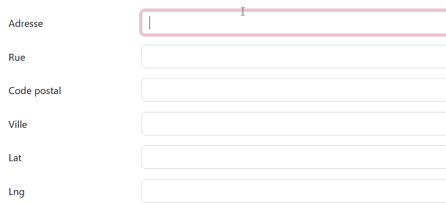
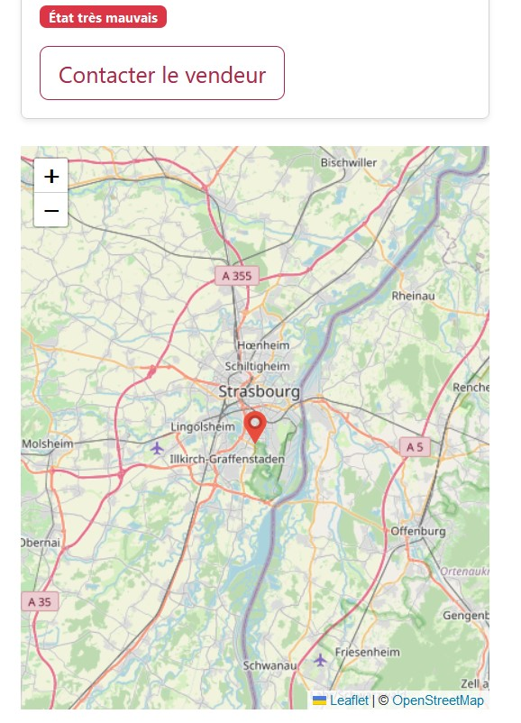
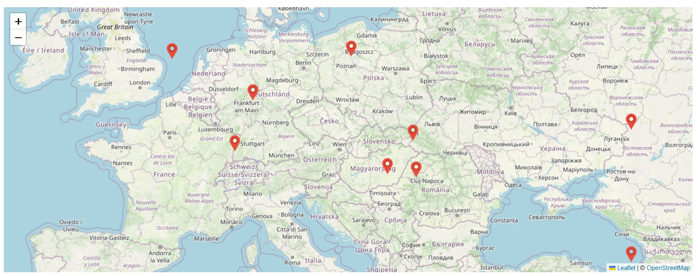
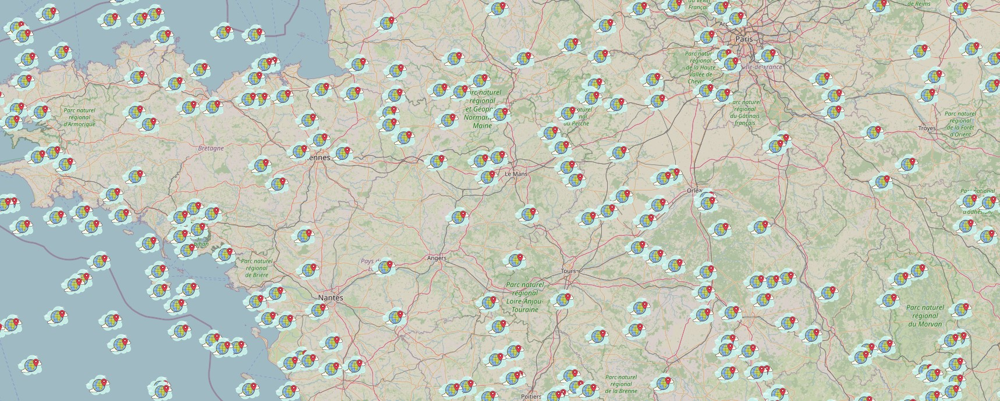
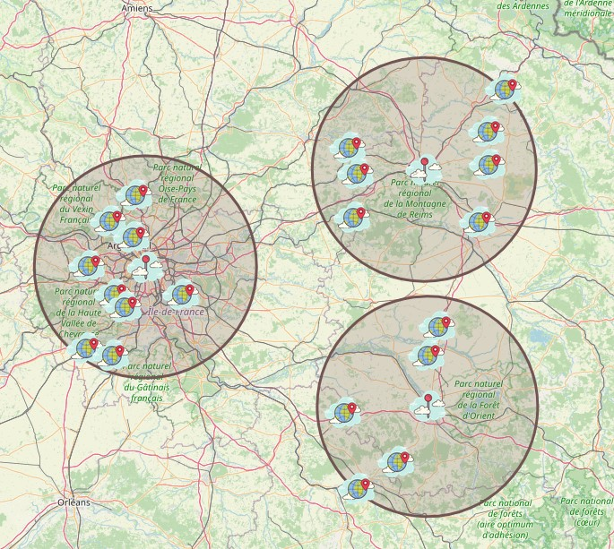
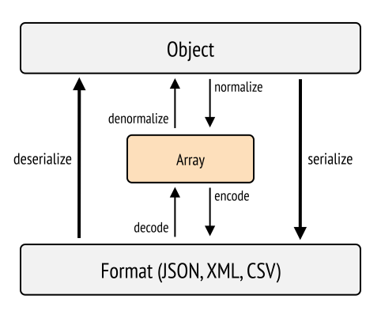

# Localisation des annonces

> Les documentations seront tes meilleures amies si tu souhaites progresser. Il faut essayer de les comprendre et ne pas en avoir peur !
> Je t'invite donc pas à prendre à chaque fois un moment pour lire les liens qui sont proposés dans le cours.
> (à commencer par [RTFM](https://fr.wikipedia.org/wiki/RTFM_%28expression%29), qui est une expression que tu entendras sûrement un jour si tu ne lis pas les documentations).

Dans ce chapitre, nous allons voir comment ajouter une carte sur le site, permettant de localiser les annonces. Pour localiser des lieux sur une carte, rien de tel que d'utiliser les coordonnées géographiques : la latitude et la longitude ! Par exemple, la Zone 51 se trouve prêt de Coyote Springs, située aux coordonnées 36.81783500071307, -114.93324954942855.

- La première étape consistera à ajouter à la classe annonce les champs permettant stocker les coordonnées géographiques

- Ensuite, lors de la création d'une annonce, nous allons interroger l'[API Adresse (Base Adresse Nationale - BAN) - api.gouv.fr](https://api.gouv.fr/les-api/base-adresse-nationale) qui nous permettra de récupérer les coordonnées géographiques à partir d'une adresse.

- Enfin nous utiliserons la librairie [Leaflet](https://leafletjs.com/) pour afficher les annonces sur une carte.

## Ajouter les champs de coordonnées

D'abord, posons la question : quel type de champs pour stocker la latitude et la longitude ? Pour cela, analysons une latitude et une longitude.

- Latitude : __36.81783500071307__. Valeur comprise entre -90 et +90 degrés, 2 chiffres avant la virgule. 6 chiffres après la virgule permettent une précision au mètre prêt. Nous avons donc 8 chiffres au total;

- Longitude : __-114.93324954942855__. Valeur comprise entre -180 et +180 degrés, 3 chiffres avant la virgule. 6 chiffres après la virgule permettent une précision au mètre prêt. Nous avons donc 9 chiffres au total;

Il va donc falloir créer 2 champs de type *float* avec un *scale* (chiffre après la virgule en MySql) de 6 et une *precision* (nombre total de chiffre) de 8 pour la latitude et de 9 pour la longitude.

C'est parti !

```shell
php bin/console make:entity Annonce

 Your entity already exists! So let's add some new fields!

 New property name (press <return> to stop adding fields):
 > lat

 Field type (enter ? to see all types) [string]:
 > decimal

 Precision (total number of digits stored: 100.00 would be 5) [10]:
 > 8

 Scale (number of decimals to store: 100.00 would be 2) [0]:
 > 4

 Can this field be null in the database (nullable) (yes/no) [no]:
 >

 updated: src/Entity/Annonce.php

 Add another property? Enter the property name (or press <return> to stop adding fields):
 > lng

 Field type (enter ? to see all types) [string]:
 > decimal

 Precision (total number of digits stored: 100.00 would be 5) [10]:
 > 9                                                                                                                                                                                                                

 Scale (number of decimals to store: 100.00 would be 2) [0]:
 > 4

 Can this field be null in the database (nullable) (yes/no) [no]:
 >

 updated: src/Entity/Annonce.php

 Add another property? Enter the property name (or press <return> to stop adding fields):
 >


  Success! 


 Next: When you're ready, create a migration with php bin/console make:migration
```

Ajoutons aussi des champs pour l'adresse tant qu'à faire :

```shell
php bin/console make:entity Annonce

 Your entity already exists! So let's add some new fields!

 New property name (press <return> to stop adding fields):
 > street

 Field type (enter ? to see all types) [string]:
 >

 Field length [255]:
 >

 Can this field be null in the database (nullable) (yes/no) [no]:
 >

 updated: src/Entity/Annonce.php

 Add another property? Enter the property name (or press <return> to stop adding fields):
 > postcode

 Field type (enter ? to see all types) [string]:
 >

 Field length [255]:
 >

 Can this field be null in the database (nullable) (yes/no) [no]:
 >

 updated: src/Entity/Annonce.php

 Add another property? Enter the property name (or press <return> to stop adding fields):
 > city

 Field type (enter ? to see all types) [string]:
 >

 Field length [255]:
 >

 Can this field be null in the database (nullable) (yes/no) [no]:
 >

 updated: src/Entity/Annonce.php

 Add another property? Enter the property name (or press <return> to stop adding fields):
 >


  Success! 


 Next: When you're ready, create a migration with php bin/console make:migration
```

Avant de générer la migration, vas voir ce que Symfony à généré dans l'entité __Annonce__ :

```shell
#[ORM\Column(type: Types::DECIMAL, precision: 8, scale: 4)]
private ?string $lat = null;

#[ORM\Column(type: Types::DECIMAL, precision: 9, scale: 4)]
private ?string $lng = null;
```

Génères la migration avec `php bin/console m:mi`, vérifies que celle-ci est correct et si oui, mets à jour la base de données avec `php bin/console d:m:m`.

Tu peux ajouter les champs suivants au formulaire de création et d'édition d'une annonce (c'est le fichier __/src/Form/AnnonceType.php__ pour rappel) :

```php
 ->add('address', null, ['label' => 'address', 'mapped' => false]) // ce champ permettra de rechercher l'adresse, il n'existe pas dans l'entité, alors il doit comporter l'option mapped => false
 ->add('street', null, ['label' => 'street'])
 ->add('postcode', null, ['label' => 'postcode'])
 ->add('city', null, ['label' => 'city'])
 ->add('lat') // ce champ sera caché
 ->add('lng') // ce champ sera caché
```

Tu peux aussi adapter la fixture en conséquence __src/DataFixtures/AnnonceFixtures.php__ :

```php
$annonce
    ->setLat($faker->latitude(40, 50)) // la latitude minimum et maximum pour la France (peu ou prou)
    ->setLng($faker->longitude(-5, 6)) // la longitude minimum et maximum pour la France (peu ou prou)
    ->setStreet($faker->streetAddress)
    ->setCity($faker->city)
    ->setPostcode($faker->postcode)
    ->setImageUrl($faker->imageUrl) // un petit oubli
;
```

## API Adresse

L'idée est que quand un utilisateur tape une adresse dans le champ si bien nommé _address_, une liste d'adresse apparaîtra sous ce champ et il pourra choisir l'adresse qui lui convient. Lorsqu'il cliquera sur un élément de la liste, le système complétera les champs _street_, _postcode_, _city_, _lat_, et _lng_. Quand il soumettra le formulaire, nous aurons toutes les coordonnées qui s'enregistreront en base de données !

### Comment fonctionne l'API Adresse ?

Première chose à faire : [aller sur la doc](https://adresse.data.gouv.fr/api-doc/adresse) ! 

Que peut-on retenir ? 

- cette API ne répond qu'au verbe HTTP __GET__ (récupérer). 

- Le _endpoint_ (l'url de l'API) est `https://api-adresse.data.gouv.fr` 

- La ressource pour rechercher une adresse est `/search/`

- Le paramètre de recherche est défini grâce à `?q=` et la recherche doit ressembler à ceci `8+bd+du+port`

- Il est possible d'ajouter d'autres paramètres tels que
  
  - le code postal avec `&postcode=44380`
  
  - le type avec `&type=street`
  
  - la latitude et la longitude avec `&lat=48.789&lon=2.789`
  
  - l'autocomplétion avec `&autocomplete=0`
  
  - et la limite avec `&autocomplete=0`

Mit bout à bout voici à quoi pourrait ressembler une requête :

`https://api-adresse.data.gouv.fr/search/?q=8+bd+du+port&limit=15`

Tu peux tester facilement cette API en utilisant un logiciel tel que [Insomnia](https://insomnia.rest/download) ou [Postman](https://www.postman.com/) ou encore plus simplement en rentrant cette url dans un navigateur 🐒.

La réponse de l'API sera au format JSON respectant la spec [GeoCodeJSON](https://github.com/geocoders/geocodejson-spec).

### JavaScript pour appeler l'API

Dès qu'un utilisateur tape une adresse dans le champ adresse,

- nous allons faire un appel à l'API avec les informations renseignées par l'utilisateur ; 
- l'API nous répondra avec une réponse JSON contenant des suggestions d'adresses ;
- nous allons utiliser cette réponse pour créer une liste contentant les adresses suggérées.

Pour éviter un rechargement de page, nous allons écrire cette fonctionnalité avec JavaScript. 
C'est ce qu'on appelle le principe AJAX :  


Mais non pas ce type d'AJAX !🤦

Ce type d'[AJAX](https://developer.mozilla.org/fr/docs/Web/Guide/AJAX). 
Cet ensemble de techniques permet d'afficher de créer du contenu sans rechargement de page ! 

- Sur YouTube par exemple, c'est ce qu'il se passe quand tu scroll et que des vidéos s'affichent encore et encore et encore et en...
- sur Facebook, lorsque tu postes un commentaire, celui s'ajoute à la fin des autres commentaires et la page n'est pas rechargée.

Vu que nous n'aurons besoin de cette fonctionnalité d'autocomplétion seulement sur certaines pages de l'application, notamment dans l'ajout et l'édition d'une annonce, nous n'allons charger les fichiers JavaScript nécessaire uniquement sur les pages concernées. Pour cela, il faut ajouter un nouveau point d'entrée.

Crées deux fichiers :

- un fichier __assets/js/autoCompleteAddress.js__ avec le contenu
  
  ```javascript
  const autoCompleteAddress = () => {
    console.log('autoCompleteAddress OK')
  }
  ```

export default autoCompleteAddress

```
- et un fichier __assets/formAnnonce.js__ avec le contenu 

```javascript
import autoCompleteAddress from "./js/autoCompleteAddress"

autoCompleteAddress() // on appelle la fonction importée
```

Puis ajoute une nouvelle entrée dans la configuration de Webpack (c'est le fichier __webpack.config.js__ pour rappel)

```javascript
.addEntry('formAnnonce', './assets/formAnnonce.js')
```

Il ne reste plus qu'à lier les fichiers qui seront compilés dans les templates __templates/annonce/edit.html.twig__ et __templates/annonce/new.html.twig__

```twig

    {{ parent() }}
    {{ encore_entry_script_tags('formAnnonce') }}

```

Tu peux lancer la commande `npm run watch` et laisser le terminal ouvert. Les fichiers seront compilés à chaque enregistrement. Vas sur la page de création d'une annonce et ouvres la console. Tu devrais voir dans la console `autoCompleteAddress OK`.

#### Exercice

Je te laisse essayer de récupérer les coordonnées géographiques à partir de l'adresse renseignée par l'utilisateur.



 Pour ce faire, voici les étapes à suivre et ce dont tu auras besoin :

- Sélectionner le champ (input) permettant de renseigner l'adresse avec [document.querySelector - Référence Web API | MDN](https://developer.mozilla.org/fr/docs/Web/API/Document/querySelector);

- écouter l'événement `keyup` de cet élément, si bien que lorsque que l'utilisateur tape une lettre, une action sera exécutée (un `console.log` par exemple)[EventTarget.addEventListener() - Référence Web API | MDN](https://developer.mozilla.org/fr/docs/Web/API/EventTarget/addEventListener);

- lorsque que l'utilisateur tape une lettre, envoyer une requête GET grâce à [Fetch - Référence Web API | MDN](https://developer.mozilla.org/fr/docs/Web/API/Fetch_API/Using_Fetch). N'hésite pas à faire un `console.log` du résultat pour voir comment parcourir l'objet reçu;

- lorsque l'API répond, construire une liste de `li` avec les données des adresses récupérées avec [document.createElement - Référence Web API | MDN](https://developer.mozilla.org/fr/docs/Web/API/Document/createElement) et afficher cette liste sous le champ de recherche avec [Element.after() - Web APIs | MDN](https://developer.mozilla.org/en-US/docs/Web/API/Element/after);

- sur chaque `li`, écouter l'événement `click` si bien que lorsque l'utilisateur clique sur un élément `li`, les champs rue, code postal, ville, latitude et longitude soient remplie avec les données de l'adresse sélectionnée.


##### Correction

Voici une proposition de correction :

Dans le fichier __assets/js/autoCompleteAddress.js__ :

```javascript
const endpoint = new URL('https://api-adresse.data.gouv.fr/search/')

const autoCompleteAddress = (fieldSelector, onChoose) => {
    const searchElement = document.querySelector(fieldSelector)
    const resultContainer = createResultContainer()
    searchElement.after(resultContainer)
    let timer = null

    searchElement.addEventListener('keyup', (e) => {
        if (timer) {
            clearTimeout(timer)
        }

        if (e.target.value.length < 4) {
            resultContainer.innerHTML = ''
            return
        }

        if (e.keyCode === 16) {
            return
        }

        timer = setTimeout(() => {
            const userQuery = e.target.value.trim().replaceAll(' ', '+')
            search(userQuery).then(data => {
                resultContainer.innerHTML = ''
                data.features.forEach(address => {
                    const li = document.createElement('li')
                    li.classList.add('list-group-item')
                    li.innerText = address.properties.label
                    li.addEventListener('click', () => {
                        resultContainer.innerHTML = ''
                        searchElement.value = address.properties.label
                        onChoose(address)
                    })
                    resultContainer.appendChild(li)
                })
            })
        }, 500)
    })
}

const search = (query) => {
    endpoint.searchParams.set('q', query)
    endpoint.searchParams.set('autocomplete', '1')
    return fetch(endpoint).then(r => r.json())
}

const createResultContainer = () => {
    const resultContainer = document.createElement('ul')
    resultContainer.classList.add('list-group')
    resultContainer.style.position = 'absolute'
    return resultContainer
}

export default autoCompleteAddress
```

Puis dans le fichier __assets/formAnnonce.js__ :

```javascript
import autoCompleteAddress from "./js/autoCompleteAddress"

autoCompleteAddress('#annonce_address', address => {
    document.querySelector('#annonce_street').value = address.properties.name
    document.querySelector('#annonce_postcode').value = address.properties.postcode
    document.querySelector('#annonce_city').value = address.properties.city
    document.querySelector('#annonce_lat').value = address.geometry.coordinates[1]
    document.querySelector('#annonce_lng').value = address.geometry.coordinates[0]
})
```

## Afficher une carte dans le détail d'une annonce

Comme je le disais, nous allons utiliser la librairie [Leaflet](https://leafletjs.com/) pour afficher une carte permettant de localiser l'annonce. La carte sera positionner à droite, sous le prix.  



La première chose à faire est donc d'installer la librairie (décrit dans la documentation [Download - Leaflet - a JavaScript library for interactive maps](https://leafletjs.com/download.html)) : 

```shell
npm install leaflet
```

Comme avant, tu peux créer un nouveau fichier **assets/showAnnonce.js**. Ce fichier ne sera appelé que sur la page de détail d'une annonce. Tu peux y mettre ce contenue: 

```javascript
import L from 'leaflet'
import '../../node_modules/leaflet/dist/leaflet.css'
console.log(L)
```

Et ajouter une entrée à __webpack.config.js__

```javascript
.addEntry('showAnnonce', './assets/showAnnonce.js')
```

Il faut aussi lier les fichiers compilés à l'application. Pour cela, édite le fichier __templates/annonce/show.html.twig__ :

```twig

    {{ parent() }}
    {{ encore_entry_link_tags('showAnnonce') }}



    {{ parent() }}
    {{ encore_entry_script_tags('showAnnonce') }}

```

En allant sur la page de détail d'une annonce, tu devrais voir l'objet Leaflet en console.

### Exercice

Essaie d'afficher une carte avec un marqueur aux coordonnées de l'annonce. Tu peux suivre ces étapes :

- Pour accéder aux coordonnées de l'annonce depuis JavaScript, tu peux procéder de différentes manières, mais la façon la plus simple est de stocker les coordonnées dans l'attribut data d'un élément HTML, et ainsi le récupérer grâce à l'attribut `dataset`. Exemple:
  
  ```twig
  <div id="map" data-lat="{{ annonce.lat }}" data-lng="{{ annonce.lng }}" style="height: 500px"></div>
  ```
  
  ```javascript
  const mapElement = document.querySelector('#map')
  const lat = mapElement.dataset.lat
  const lng = mapElement.dataset.lng
  ```

- pour afficher une carte avec Leaflet, tu peux suivre le [Quick Start Guide](https://leafletjs.com/examples/quick-start/). Leaflet utilise des tiles (des petites images, des tuiles) pour afficher la carte. Dans l'exemple du guide, on utilise `https://tile.openstreetmap.org/{z}/{x}/{y}.png`. 
Ce sont les tiles d'[OpenStreetMap](https://www.openstreetmap.org/#map=6/46.449/2.210). L'utilisation de ces tuiles est soumise à conditions, donc si tu souhaites les utiliser pour un projet réel, je te conseille vivement de lire la page [Tile Usage Policy](https://operations.osmfoundation.org/policies/tiles/).
Il existe d'autres serveurs de tuiles, comme [celui-ci](http://maps.stamen.com) par exemple. Voici une [liste](https://www.trailnotes.org/FetchMap/TileServeSource.html) que j'ai trouvée sur le web. Renseigne-toi avant de les utiliser dans un vrai projet !
- dès qu'il faut renseigner des coordonnées, Leaflet prend en paramètre un tableau contenant la latitude et la longitude, dans cet ordre. Par exemple : `center: [lat, lng]`

Je te laisse essayer 🙊


#### Correction

Voici une proposition de correction. 

Dans __templates/annonce/show.html.twig__ :

```twig
<div id="map" data-lat="{{ annonce.lat }}" data-lng="{{ annonce.lng }}" style="height: 500px"></div>
```

Dans __assets/entries/showAnnonce.js__ :

```javascript
import L from 'leaflet'
import '../../node_modules/leaflet/dist/leaflet.css'
import mapWorldIcon from '../img/map-world-icon.png' // on importe une image qui servira pour créer le marker

const mapElement = document.querySelector('#map')
const lat = mapElement.dataset.lat
const lng = mapElement.dataset.lng

const map = L.map('map', {
    center: [lat, lng],
    zoom: 10
})

L.tileLayer('https://tile.openstreetmap.org/{z}/{x}/{y}.png', {
    maxZoom: 19,
    attribution: '© <a href="http://www.openstreetmap.org/copyright">OpenStreetMap</a>'
}).addTo(map)

L.marker([lat, lng], {
    icon: L.icon({
        iconUrl: mapWorldIcon, // image personnalisée
        iconSize: [50, 50]
    })
}).addTo(map)
```

J'ai ajouté une image pour avoir un marqueur personnalisé avec `import mapWorldIcon from '../img/map-world-icon.png'`. 
Tu peux trouver une image de marker sur le web et l'enregistrer sous __/assets/img/map-marker.png__. Pour ma part, j'ai utilisé [cette image](https://icones8.fr/icon/65227/lieu-dans-le-monde-entier).

Tu peux aller voir sur la page de détail d'une annonce pour voir le résultat !

## Affichage de toutes les annonces sur une carte

Objectif : Sur la page d'accueil, nous allons afficher une carte qui permettra de localiser les annonces. 



Dans un premier temps et pour s'entraîner, nous afficherons __toutes__ les annonces sur la carte. 
Nous n'en avons pas beaucoup encore, donc le serveur et le navigateur tiendront la charge.  

Dans un deuxième temps, nous afficherons seulement les annonces autour d'un point sur la carte. 
Par exemple, toutes les annonces situées à 5km de la Cathédrale de Strasbourg.

Dans les grandes lignes :

- Il faudra créer un script JavaScript qui fera une requête avec [_fetch_](https://developer.mozilla.org/fr/docs/Web/API/Fetch_API/Using_Fetch) 
  à l'application Symfony. Vers une route correspondant à une méthode d'un controller donc ;
- cette méthode cherchera toutes les annonces en base de données ;
- puis elle renverra les annonces au format JSON, ainsi, nous pourrons traiter ces données grâce à JavaScript.

Nous allons encore une fois utiliser le principe AJAX comme expliqué plus haut dans le tuto.

### Le controller

Commençons par le controller, nous n'avons pas besoin de JavaScript tout de suite.

Un petit coup de `php bin/console make:controller Ajax\Annonce` permet de créer un controller dans le dossier __/src/Controller/Ajax__. Nous aurions pu faire un dossier __Api__, mais nous n'allons pas vraiment créer une API. 
Et peut-être qu'un jour, j'aurais le temps d'écrire un chapitre pour expliquer comment créer une API avec Symfony, et ce dossier sera peut-être utile. Nous verrons ! Dans le doute, ne fermons pas de portes 😅

Voici ce que tu peux mettre dans ce controller :

```php
<?php

namespace App\Controller\Ajax;

use Symfony\Bundle\FrameworkBundle\Controller\AbstractController;
use Symfony\Component\HttpFoundation\Response;
use Symfony\Component\Routing\Annotation\Route;

#[Route('/ajax')]
class AnnonceController extends AbstractController
{
    #[Route('/annonce', methods: ['GET'])]
    public function index(): Response
    {
        return new Response('hello', 200, [
            'Content-Type' => 'application/json'
        ]);
    }
}
```

Depuis ton navigateur, vas sur l'url http://127.0.0.1:8000/ajax/annonce pour voir le résultat ! N'est-ce pas magnifique !
Nous avons renvoyé une réponse JSON en un rien de temps !

Si tu connais un peu le protocole HTTP, tu devrais savoir expliquer les paramètres passés à `Response`. 
Sinon, attardons-nous un peu sur cet objet :

```php
return new Response(
    'hello', // le contenu de la réponse
    200, // le code de réponse, tu connais le code 404. Le code 200 signifie que la ressource a été trouvée
    [ // un tableau pour spécifier les headers de la réponse HTTP
        'Content-Type' => 'application/json' // on spécifie qu'on renvoie du JSON
    ]
);

return new Response(
    '<h1>hello</h1>', // le contenu de la réponse
    200, // le code de réponse, tu connais le code 404. Le code 200 signifie que la ressource a été trouvée
    [ // un tableau pour spécifier les headers de la réponse HTTP
        'Content-Type' => 'text/html' // on spécifie qu'on renvoie du HTML
    ]
);
```

Tous les codes de réponse HTTP sont listés sur [la doc MDN](https://developer.mozilla.org/fr/docs/Web/HTTP/Status).
Il convient de renvoyer le bon code pour chaque réponse.

Imaginons que nous ayons des données sous formes de tableau,
et que nous souhaitions les envoyer au front-end, au format JSON, voici comment nous pourrions procéder :

```php
    #[Route('/annonce', methods: ['GET'])]
    public function index(): Response
    {
        $annonces = [
            [
                'id' => 1002,
                'title' => 'ut corrupti culpa',
                'description' => 'Provident eos sint quam beatae iste itaque culpa similique. Doloremque perferendis officiis et aut. Tenetur suscipit repudiandae fugit quaerat.'
            ],
            [
                'id' => 1003,
                'title' => 'ea voluptatibus pariatur',
                'description' => 'Magni et id cum sunt. Voluptates dolorem sunt nihil libero exercitationem dolor. Sapiente illum expedita vitae enim quos soluta error.'
            ]
        ];
        return new Response(
            json_encode($annonces), // json_encode permet de transformer un tableau PHP au format JSON, pile ce qu'il nous faut !
            200,
            ['Content-Type' => 'application/json']
        );
    }
```

#### Exercice

Ton but va être d'envoyer les annonces non vendues, récupéré depuis la base de données, au format JSON.  
Pour ce faire, tu peux procéder comme suit :

- récupères toutes les annonces non vendues grâce au repository `AnnonceRepository` et stockes le résultat dans une variable `$annonces`;
- crées une nouvelle variable `$data = []` qui est un tableau et qui te servira à stocker les champs que tu désires envoyer ;
- parcours le tableau `$annonces` avec faire une boucle `foreach` et remplis le tableau `$data` pour qu'il ressemble à ce résultat :
  
  ```php
  $data = [
    [
        'id' => 1002,
        'title' => 'ut corrupti culpa',
        'description' => 'Provident eos sint quam beatae iste itaque culpa similique. Doloremque perferendis officiis et aut. Tenetur suscipit repudiandae fugit quaerat.'
    ],
    [
        'id' => 1003,
        'title' => 'ea voluptatibus pariatur',
        'description' => 'Magni et id cum sunt. Voluptates dolorem sunt nihil libero exercitationem dolor. Sapiente illum expedita vitae enim quos soluta error.'
    ]
  ];
  ```
- retournes une réponse JSON avec pour contenu le tableau `$data`, transformée au préalable au format JSON avec la fonction `json_encode`

Ahodi Cow Boy ! 🤠


##### Correction

Voici le code que je te propose :

```php
<?php

namespace App\Controller\Ajax;

use App\Repository\AnnonceRepository;
use Symfony\Bundle\FrameworkBundle\Controller\AbstractController;
use Symfony\Component\HttpFoundation\Response;
use Symfony\Component\Routing\Annotation\Route;
use Symfony\Component\Routing\Generator\UrlGeneratorInterface;

#[Route('/ajax')]
class AnnonceController extends AbstractController
{
    #[Route('/annonce', methods: ['GET'])]
    public function index(AnnonceRepository $annonceRepository, UrlGeneratorInterface $urlGenerator): Response
    {
        $annonces = $annonceRepository->findAllNotSold();
        $data = [];

        foreach ($annonces as $property => $annonce) {
            $data[] = [
                'id' => $annonce->getId(),
                'title' => $annonce->getTitle(),
                'description' => $annonce->getDescription(),
                'price' => $annonce->getPrice(),
                'status' => $annonce->getStatus(),
                'createdAt' => $annonce->getCreatedAt(),
                'updatedAt' => $annonce->getCreatedAt(),
                'slug' => $annonce->getStatus(),
                'imageUrl' => $annonce->getImageUrl(),
                'street' => $annonce->getStreet(),
                'postcode' => $annonce->getPostcode(),
                'city' => $annonce->getCity(),
                'lat' => $annonce->getLat(),
                'lng' => $annonce->getLng(),
                'link' => $urlGenerator->generate('app_annonce_show', ['id' => $annonce->getId(), 'slug' => $annonce->getSlug()])
            ];
        }
        // héhé ! Tu as vu cette petite filouterie ?
        // Symfony nous met à disposition cette fonction qui renvoie une réponse JSON et qui applique json_encode !
        return $this->json($data); 
    }
}
```

Voici comment tu peux t'en sortir pour renvoyer du JSON depuis un controller. On peut tout de même se poser les questions 
suivantes : 

- _que se passera-t-il si on ajoute des champs à l'entité Annonce ?_
- _si nous avons besoin de renvoyer le même JSON à un autre endroit dans l'application, va-t-on devoir copier/coller ce code ?_
- _est-ce qu'il n'y a pas un moyen plus simple et moins long de transformer une collection d'entité en JSON ?_
- _quel est le sens de la vie ?_ 🤔
  Tant de questions sans réponses... 

Bon en fait si, la réponse, c'est que plus tard dans le tutorial on fera quelque chose de plus propre. 
Mais restons simple pour le moment : comprenons comment fonctionne AJAX ! 

### Le JavaScript

Je te propose de créer un nouveau fichier JavaScript __/assets/home.js__ avec ce contenu

```javascript
import L from 'leaflet'
import '../../node_modules/leaflet/dist/leaflet.css'

const getAnnonces = () => {
    // ici nous ferons une requête au serveur avec fetch
    console.log(route)
}

getAnnonces() // on appelle la fonction getAnnonces()
```

Puis d'ajouter ce fichier comme entrée dans __webpack.config.js__

```javascript
.addEntry('home', './assets/home.js')
```

Et enfin de lier ce fichier à la page de la home, dans __templates/home/index.html.twig__ :

```twig


    {# reste du code #}
    <div class="container-fluid my-3">
        <div id="map" style="height: 1000px;"></div>
    </div>



    {{ parent() }}
    {{ encore_entry_link_tags('home') }}



    {{ parent() }}
    {{ encore_entry_script_tags('home') }}
    <script>
        // on crée une constante JavaScript qui stock le résultat la fonction `url` de _Twig_
        const route = "{{ url('app_ajax_annonce_index')|escape('js') }}";
    </script>

```

Grâce à ce bout de code, on peut partager une route Symfony avec JavaScript :

```twig
<script>
    const route = "{{ url('app_ajax_annonce_index')|escape('js') }}";
</script>
```
Ici on crée une constante JavaScript qui stock le résultat la fonction `url` de _Twig_. On a mélangé du JavaScript et du _Twig_.  
Cette constante est disponible dans le contexte __window__ car elle est créée dans un template Twig, dans les balises `<script>`. 
Tous nos scripts peuvent y accéder ! Pour preuve, tu peux recharger la page et taper `route` dans la console du navigateur.  
Si tu n'as pas compris pourquoi cette constante est accessible dans tous les scripts JavaScript, alors il faut que tu lises [cet article](https://developer.mozilla.org/fr/docs/Web/JavaScript/Guide/Grammar_and_types#les_port%c3%a9es_de_variables).  
Cela peut sembler étrange comme façon de faire, mais [c'est écrit dans la doc !](https://symfony.com/doc/current/routing.html#generating-urls-in-javascript). 
Je n'utilise pas la fonction `path` comme décrit dans la documentation, mais j'utilise la fonction `url`, car nous aurons besoin d'une url absolue plus loins dans le tutorial.

Lance `npm run watch` si ce n'est pas encore fait, charge la page d'accueil et regarde le résultat en console :
tu devrais voir `/ajax/annonce` dans la console.

#### Exercice
Bon et bien je crois que tu as toutes les cartes pour continuer seul(e) 💪


Tu trouves que je suis trop confiant ? Voyons un peu tout ce que tu sais faire maintenant :

- faire des requêtes depuis JavaScript avec fetch ;
- transformer la réponse JSON en objet JavaScript ;
- traiter cet objet JavaScript pour créer des nouveaux éléments HTML et les injecter dans le DOM ;
- afficher une carte sur une page grâce à Leaflet ;
- positionner la carte à certaines coordonnées ;
- ajouter un marqueur sur la carte à certaines coordonnées.

C'est bon, tu a ce qu'il faut pour faire la suite.

Pour rappel, le serveur renvoie désormais une réponse JSON, contenant toutes les annonces, et nous voulons afficher ces annonces sur une carte.
La suite consiste donc à faire une requête au serveur et de traiter la réponse grâce à JavaScript, afin d'arriver au résultat escompté. 

Cette fois, je te laisse quelques minutes pour essayer de trouver les étapes à réaliser par toi-même.  
Tout ce que je peux te dire, c'est qu'à partir de maintenant, tout le code que tu écriras se trouvera dans __assets/entries/home.js__.
Tu peux donc écrire les étapes dans ce fichier, ça t'aidera à y voir plus clair :)  

Aller je te laisse ! Je vais prendre un café !


Voici un peu d'aide si besoin :

- dans le JavaScript, affiche une carte dans ` <div id="map">` avec `Leaflet` ;
- dans la fonction `getAnnonces`, fais une requête vers `route` avec `fetch` ([voici un peu d'aide](https://fr.javascript.info/fetch));
- lorsque le serveur répond (`then`), transforme le résultat en objet littéral (fonction `.json()`) et lorsque cet objet est disponible (`then`), fais un `console.log` de l'objet JavaScript reçu en paramètre ;
- parcours cet objet avec une boucle ;
- dans la boucle, à chaque itération, crées un objet `marker` et ajoute ce marqueur à la carte ([voir la documentation](https://leafletjs.com/reference.html#marker));
- toujours dans la boucle, sur chaque `marker` tu peux ajouter une `popup` ([voir la documentation](https://leafletjs.com/reference.html#popup))
- il faudrait aussi stocker tous les marker créés dans un tableau, afin de pouvoir les supprimer par la suite.
- et voilà.


##### Correction

Voici le code JavaScript que je te propose :

```javascript
// tout en haut, avec les autres import
import mapWorldIcon from '../img/map-world-icon.png'

// reste du code

const url = new URL(route)

const map = L.map('map', {
  center: [48.856962956340844, 2.3463447979091545],
  zoom: 8,
  scrollWheelZoom: false // on desactive le zoom sur la carte avec la molette de la souris
})

L.tileLayer('https://tile.openstreetmap.org/{z}/{x}/{y}.png', {
  maxZoom: 19,
  minZoom: 8,
  attribution: '&copy; <a href="http://www.openstreetmap.org/copyright">OpenStreetMap</a>'
}).addTo(map)

const mapWorldMarker = L.icon({
  iconUrl: mapWorldIcon,
  iconSize: [50, 50]
})

const annonceMarkers = [] // pour stocker les marker afin de pouvoir les supprimer plus tard

const getAnnonces = () => {
    fetch(url, {
      headers: {
        'Accept': 'application/json', // on demande une réponse au format JSON. C'est au serveur (à notre application Symfony), de fournir ce que le client à demandé. Cela tombe bien, nous envoyons seulement envoyer du JSON.
      }
    })
    .then(r => r.json())
    .then(annonces => {
      annonces.forEach(annonce => {
        const marker = L.marker([
          annonce.lat,
          annonce.lng
        ], {
          icon: mapWorldMarker
        })
        marker.bindPopup(`
          <div class="card border-0">
              
              <div class="card-body">
                  <h2 class="card-title pricing-card-title">${annonce.price / 100}<small class="text-muted fw-light">€</small></h2>
                  <h5 class="card-title">${annonce.title}</h5>
                  <p class="card-text">
                      ${annonce.description}
                  </p>
                  <a href="${annonce.link}" class="btn btn-secondary">Voir</a>
                </div>
              </div>
              <div class="card-footer text-muted">Lat: ${annonce.lat} / Lng: ${annonce.lng}</div>
          </div>
        `)
        marker.addTo(map)
        annonceMarkers.push(marker)
      })
    })
}

getAnnonces()
```

Compiles le JavaScript et vas voir le résultat dans ton navigateur sur la page d'accueil. WOOOOUUU ! Tous ces marqueurs !  


## Demander la position de l'utilisateur
Dans cette section, nous allons positionner la carte aux coordonnées de l'utilisateur. 
Tu sais quand un site (comme Le Bon Coin par exemple), demande d'accéder à ta position ? Eh bien, c'est ce que nous allons faire.

Nous allons donc ajouter un bouton au-dessus de la carte. Quand un utilisateur cliquera sur ce bouton, le navigateur demandera si notre application 
peut accéder à sa position. Si l'utilisateur autorise l'accès, nous positionnerons la carte à ses coordonnées.

Pour cela, nous allons utiliser l'[API Geolocation de JavaScript](https://developer.mozilla.org/fr/docs/Web/API/Geolocation_API#exemples). 
Je te laisse lire la documentation quelques minutes.

### Ajout du bouton
Dans le fichier __templates/home/index.html.twig__, je te propose d'ajouter ce code, au-dessus de la carte :
```twig
<div class="container">
    <div class="row">
        <div class="col-md-12">
            <h2>Rechercher des annonces sur la carte</h2>
        </div>
        <div class="col-md-12">
            <div class="input-group my-3">
                <button id="localizeMe" class="btn btn-primary">Ou localisez moi</button>
            </div>
        </div>
        <div class="col-md-12">
            <div class="input-group my-3">
                <span class="input-group-text bg-secondary" id="userLatitudeLabel">Latitude</span>
                <input disabled type="text" class="form-control" id="userLatitude" aria-describedby="userLatitudeLabel">
                <span class="input-group-text bg-secondary" id="userLongitudeLabel">Longitude</span>
                <input disabled type="text" class="form-control" id="userLongitude" aria-describedby="userLongitudeLabel">
            </div>
        </div>
    </div>
</div>
```

Recharge la page d'accueil pour voir le résultat :)

### Exercice
En t'aidant de la documentation de l'[API Geolocation de JavaScript](https://developer.mozilla.org/fr/docs/Web/API/Geolocation_API#exemples), 
procède aux étapes suivantes, dans le fichier __assets/entries/home.js__ :
- lorsque l'utilisateur [clique](https://developer.mozilla.org/fr/docs/Web/API/EventTarget/addEventListener) sur le bouton `#localizeMe`, demande à accéder à sa [géolocalisation](https://developer.mozilla.org/en-US/docs/Web/API/Geolocation_API/Using_the_Geolocation_API) ;
- si l'utilisateur autorise l'accès : 
  - [change la valeur](https://developer.mozilla.org/fr/docs/Web/HTML/Element/input/text#valeur) des champs `#userLatitude` et `#userLongitude` avec les informations trouvées ;
  - [positionne la carte](https://leafletjs.com/reference.html#map-setview) aux coordonnées de l'utilisateur ;
- s'il refuse, [affiche un message](https://developer.mozilla.org/fr/docs/Web/API/Window/alert) avec `alert('Vous avez refusé la l\'accès à votre position.')`


#### Correction 
```javascript
// tout en haut, avec les autres import
import mapPinIcon from '../img/map-pin-icon.png' // j'ai trouvé cette image ici : https://icones8.fr/icon/114621/epingle-de-carte

// reste du code

const positionMarkers = [] // pour stocker les marker de position, afin de les supprimer plus tard

const mapPinMarker = L.icon({
  iconUrl: mapPinIcon,
  iconSize: [50, 50]
})

/**
 * Remplit les champs #userLatitude et #userLongitude
 * 
 * @param latitude
 * @param longitude
 */
const fillPositionForm = (latitude, longitude) => {
  document.querySelector('#userLatitude').value = latitude
  document.querySelector('#userLongitude').value = longitude
}

/**
 * Centre la carte aux coordonnées indiquées et ajoute une marker avec une popoup
 * 
 * @param latitude
 * @param longitude
 * @param popupText
 */
const centerMap = (latitude, longitude, popupText) => {
  map.setView([latitude, longitude], 13)
  
  const marker = L.marker([
    latitude,
    longitude
  ], {
    icon: mapPinMarker
  })

  map.addLayer(marker)
  marker.bindPopup(popupText).openPopup()
  positionMarkers.push(marker)
}

document.querySelector('#localizeMe').addEventListener('click', () => {
  if ('geolocation' in navigator) {
    navigator.geolocation.getCurrentPosition(position => {
      centerMap(
        position.coords.latitude,
        position.coords.longitude,
        `Votre position ${position.coords.latitude}, ${position.coords.longitude}`
      )
      fillPositionForm(position.coords.latitude, position.coords.longitude)
    }, positionError => {
      alert(`Impossible de vous géolocaliser: ${positionError.message}`)
    })
  } else {
    alert('Votre navigateur ne supporte pas la géolocalisation')
  }
})
```
Après avoir compilé les __assets__ et rechargé la page, tu peux tester que la géolocalisation fonctionne bien. 

## Positionner la carte sur une adresse
Nous pouvons aller un peu plus loin et proposer à l'utilisateur de rentrer une adresse lui-même, afin de positionner la carte à cette adresse.

Et la bonne nouvelle, c'est que nous n'avons presque rien à faire , souviens-toi, nous avions créé un petit composant __assets/js/autoCompleteAddress.js__ qui permet déjà de faire la recherche des adresses !


Nous allons déjà créer le formulaire de recherche d'adresse. Dans __templates/home/index.html.twig__, tu peux ajouter :
```twig
<div class="container">
    <div class="row">
        <div class="col-md-12">
            {# code existant #}
        </div>
        <div class="col-md-12">
            <div class="input-group my-3">
            
                {# code à ajouter #}
                <span class="input-group-text bg-secondary" id="searchAddressLabel">Chercher une adresse</span>
                <input type="text" class="form-control" id="searchAddress" aria-describedby="searchAddressLabel">
                {# fin du code à ajouter #}
            
                <button id="localizeMe" class="btn btn-primary">Ou localisez moi</button>
            </div>
        </div>
        <div class="col-md-12">
            {# code existant #}
        </div>
    </div>
</div>
```
Et voilà, il n'y a plus qu'à utiliser le composant dans __assets/entries/home.js__ :
```javascript
// tout en haut, avec les autres import
import autoCompleteAddress from "../js/autoCompleteAddress";

// reste du code

autoCompleteAddress('#searchAddress', address => {
    fillPositionForm(address.geometry.coordinates[1], address.geometry.coordinates[0])
    centerMap(
        address.geometry.coordinates[1], 
        address.geometry.coordinates[0], 
        `Adresse: ${address.properties.label}`
    )
})
```
Après avoir compilé les __assets__ et rechargé la page, tu peux rechercher une adresse et la carte se positionnera aux coordonnées de celle-ci. 

## Rechercher autour des coordonnées
Afficher toutes les annonces, c'est bien, mais cela risque de poser des problèmes de performance si notre application contient beaucoup d'annonce.

Ce qu'il faudrait, c'est afficher __seulement__ les annonces autour de l'adresse choisit ou de la géolocalisation de l'utilisateur.
Mais comment faire ?

Nous pouvons utiliser une formule mathématique qui peut s'appliquer avec une requête MySql. 
Cette formule permet de trouver des items sur une sphère, selon une latitude et une longitude, ainsi que selon une distance.
C'est la [Formule de haversine](https://fr.wikipedia.org/wiki/Formule_de_haversine), tu peux jeter un œil :)

Nous avons donc besoin d'envoyer ces informations au back-end : la latitude, la longitude et la distance de recherche.
Nous allons donc ajouter un champ au formulaire de recherche et un bouton qui permettra de lancer la recherche. Dans __templates/home/index.html.twig__ :
```twig
<div class="container">
    <div class="row">
        <div class="col-md-12">
            {# code existant #}
        </div>
        <div class="col-md-12">
            {# code existant #}
        </div>
        <div class="col-md-12">
            <div class="input-group my-3">
                {# code existant #}
                
                {# code à ajouter #}
                <input class="form-control" type="number" id="userDistance" aria-describedby="userDistanceLabel">
                <span class="input-group-text">km</span>
                <button class="btn btn-primary input-group-text" id="searchOnMap">Rechercher</button>
                {# fin du code à ajouter #}
            </div>
        </div>
    </div>
</div>
```

Nous allons ensuite modifier la signature de la fonction `getAnnonces` dans __assets/entries/home.js__ et ajouter les paramètre passé à l'url :
```javascript
const getAnnonces = (lat, lng, distance) => {
  url.searchParams.set('lat', lat)
  url.searchParams.set('lng', lng)
  url.searchParams.set('distance', distance)
  // reste du code...
}
```

Puis toujours dans __assets/entries/home.js__, nous ajoutons un eventListener sur le bouton `#searchOnMap`, qui appelle la fonction `getAnnonces` avec les bonnes informations :
```javascript
// reste du code ...
document.querySelector('#searchOnMap').addEventListener('click', () => {
    getAnnonces(
        document.querySelector('#userLatitude').value,
        document.querySelector('#userLongitude').value,
        document.querySelector('#userDistance').value
    )
})
```

Nous pouvons aussi modifier légèrement la fonction `centerMap` afin d'afficher un cercle autour du point :
```javascript
/**
 * Centre la carte aux coordonnées indiquées et ajoute une marker avec une popoup
 *
 * @param latitude
 * @param longitude
 * @param popupText
 */
const centerMap = (latitude, longitude, popupText) => {

    map.setView([latitude, longitude], 13)

    const marker = L.marker([
        latitude,
        longitude
    ], {
        icon: mapPinMarker
    })
          
    // code à ajouter
    const radius = parseInt(document.querySelector('#userDistance').value)

    const circle = L.circle([latitude, longitude], {
        color: '#725454',
        fillColor: '#725454',
        fillOpacity: 0.2,
        radius: radius * 1000
    })

    map.addLayer(circle)
    // fin du code à ajouter
          
    map.addLayer(marker)

    marker.bindPopup(popupText).openPopup()
    positionMarkers.push(marker)
    positionMarkers.push(circle)
}
```

Nous pouvons enfin récupérer ces informations depuis le controller __src/Controller/Ajax/AnnonceController.php__ 
et utiliser une méthode du `repository`, que nous allons créer juste après :
```php
// reste du code ...
use Symfony\Component\HttpFoundation\Request; // ne pas oublier ce use
// reste du code ...

    public function index(AnnonceRepository $annonceRepository, UrlGeneratorInterface $urlGenerator, Request $request): Response
    {
        $lat = (float)$request->query->get('lat');
        $lng = (float)$request->query->get('lng');
        $distance = (int)$request->query->get('distance');

        // remplacer $annonces = $annonceRepository->findAllNotSold(); par
        $annonces = $annonceRepository->findByDistance($lat, $lng, $distance); // nous allons créer cette méthode juste après 
```

Dans __src/Repository/AnnonceRepository.php__, grâce à la __formule de haversine__,
nous allons créer la méthode qui permet de rechercher par distance kilométrique à partir d'un point géographique. 
Elle est un peu compliquée à comprendre, mais tu peux l'utiliser telle quelle dans tes projets, c'est cadeau.
Il faudra juste remplacer `a.lat` et `a.lng` par l'alias et les champs de ton entité. 
```php
public function findByDistance(float $lat, float $lng, int $distance): array
{
    $haversineFormula = '(6378 * acos(cos(radians(' . $lat . ')) * cos(radians(a.lat)) * cos(radians(a.lng) - radians(' . $lng . ')) + sin(radians(' .$lat . ')) * sin(radians(a.lat))))';
    return $this->createQueryBuilder('a')
        ->andWhere($haversineFormula . ' <= :distance')
        ->andWhere('a.isSold = false')
        ->setParameter('distance', $distance)
        ->getQuery()
        ->getResult();
}
```
Tu peux essayer le formulaire de recherche ! Et constater que... ça ne fonctionne pas. Tu peux aller sur la route __/ajax/annonces__ pour voir l'erreur que Symfony a levé. 

Ce qu'il se passe, c'est que Doctrine ne possède pas toutes les fonctions MySql lors de son installation. 
Dans notre requête SQL, nous en avons plusieurs telles que `acos()`, `cos()`, `radians()` et `sin()`.  
Mais pas de panique ! Un package existe pour installer ces fonctions ! C'est le package [beberlei/doctrineextensions](https://github.com/beberlei/DoctrineExtensions).

Pour l'installer, tu peux taper dans un terminal la commande suivante :
```shell
composer require beberlei/doctrineextensions
```

Il faut ensuite configurer Doctrine pour lui expliquer quelle classe il doit changer quand il croise les fonctions citées plus haut.
Pour cela, ouvre le fichier __config/packages/doctrine.yaml__ et ajoute ceci :
```yaml
doctrine:
    dbal:
        url: '%env(resolve:DATABASE_URL)%'
        # reste de la configuration
    orm:
        auto_generate_proxy_classes: true
        # reste de la configuration
     
    # -------------------------------#   
    # à ajouter
    dql:
        numeric_functions:
            acos: DoctrineExtensions\Query\Mysql\Acos
            cos: DoctrineExtensions\Query\Mysql\Cos
            radians: DoctrineExtensions\Query\Mysql\Radians
            sin: DoctrineExtensions\Query\Mysql\Sin
    # -------------------------------# 
```

Tu peux réessayer le formulaire de recherche, normalement tout fonctionne !

Whou ! Beaucoup d'informations tout ça !  
  
Je te laisse digérer tout ça et comprendre ce qu'il s'est passé avant de passer à la suite.

## Supprimer les markers
Actuellement, si nous faisons plusieurs recherches, les markers restent affichés, comme ceci :  


Il faudrait supprimer les markers affichés sur la carte, avant chaque nouvelle recherche. Voici comment nous pourrions procéder.

Dans __assets/entries/home.js__, ajoutons cette fonction :
```javascript
const removeMarkers = (markers) => {
    for (let i = 0; i < markers.length; i++) {
        map.removeLayer(markers[i]) // removeLayer permet de supprimer un calque
    }
}
```
Et appelons la fonction `removeMarkers` dans la fonction `getAnnonces` et dans la fonction `centerMap` :
```javascript
const getAnnonces = (lat, lng, distance) => {
  removeMarkers(annonceMarkers)
  // reste du code
  // ...
}
// reste du code
const centerMap = (latitude, longitude, popupText) => {
  removeMarkers(positionMarkers)
  removeMarkers(annonceMarkers)
  // reste du code
  // ...
}
```

Voilà, les marker se suppriment à chaque recherche et à chaque changement de localisation.

## Utiliser le Serializer de Symfony 
Tu te souviens que dans __src/Controller/Ajax/AnnonceController.php__, nous construisons notre propre JSON
à partir des annonces récupérées depuis la base de données.
```php
class AnnonceController extends AbstractController
{
    #[Route('/annonce', methods: ['GET'])]
    public function index(AnnonceRepository $annonceRepository, UrlGeneratorInterface $urlGenerator, Request $request): Response
    {
        $lat = (float)$request->query->get('lat');
        $lng = (float)$request->query->get('lng');
        $distance = (int)$request->query->get('distance');
        $annonces = $annonceRepository->findByDistance($lat, $lng, $distance);
        $data = [];

        foreach ($annonces as $property => $annonce) {
            $data[] = [
                'id' => $annonce->getId(),
                'title' => $annonce->getTitle(),
                'description' => $annonce->getDescription(),
                'price' => $annonce->getPrice(),
                'status' => $annonce->getStatus(),
                'createdAt' => $annonce->getCreatedAt(),
                'updatedAt' => $annonce->getCreatedAt(),
                'slug' => $annonce->getStatus(),
                'imageUrl' => $annonce->getImageUrl(),
                'street' => $annonce->getStreet(),
                'postcode' => $annonce->getPostcode(),
                'city' => $annonce->getCity(),
                'lat' => $annonce->getLat(),
                'lng' => $annonce->getLng(),
                'link' => $urlGenerator->generate('app_annonce_show', ['id' => $annonce->getId(), 'slug' => $annonce->getSlug()])
            ];

        }
        return $this->json($data);
    }
}
```
Cela fonctionne et c'est une manière simple de renvoyer du JSON depuis un controller. Mais cette manière de faire pose quelques soucis :
- si nous devons renvoyer des annonces en JSON ailleurs dans notre application, nous devrons faire un copier / coller, et c'est une mauvaise idée ;
- si nous ajoutons des champs à l'entité, il faudra modifier ce bout de code partout où nous l'avons utilisé ;
- nous n'avons pas les entités en relations dans notre JSON. Nous pourrions les avoir, mais non sans mal.

Je ne l'ai pas mentionné avant, mais nous aurions pu essayer de faire un simple `json_encode` sur le tableau `$annonces`. 
Cela pourrait marcher !
```php
$annonces = $annonceRepository->findAllNotSold();
return new Response(json_encode($annonces), 200, [
    'Content-Type' => 'application/json'
]);
```
Mais voilà, le résultat sera le suivant :
```json
[
  {},
  {},
  {},
  {},
  {},
  {},
  {},
  {},
  {},
  {},
  {},
  {},
  {},
  {},
  {},
  {},
  {},
  {},
  {},
  {},
  {},
  {},
  {},
  {},
  {}
]
```
En effet, la fonction `json_encode` va aller chercher seulement les propriétés publiques. Hors, dans l'entité __Annonce__, toutes le propriétés sont privées.
Nous pourrions donc essayer de changer la visibilité d'une propriété en publique, cela fonctionnerait :
```php
// src/Entity/Annonce.php
class Annonce
{
    // ...
    public ?int $id = null;
    // ...
}
```
Le résultat serait le suivant :
```json
[
  {
    "id": 6003
  },
  {
    "id": 6004
  },
  {
    "id": 6005
  },
  {
    "id": 6006
  },
  {
    "id": 6007
  },
  {
    "id": 6008
  },
  {
    "id": 6009
  },
  {
    "id": 6010
  },
  {
    "id": 6011
  },
  {
    "id": 6012
  },
  {
    "id": 6013
  },
  {
    "id": 6014
  }
]
```
Mais ça se corse si on veut l'utilisateur lié à l'annonce :
```php
// src/Entity/Annonce.php
class Annonce
{
    // ...
    public  ?User $user = null;
    // ...
}
```
```json
[
  {
    "id": 6003,
    "user": {
      "__initializer__": {},
      "__cloner__": {},
      "__isInitialized__": false
    }
  },
  {
    "id": 6004,
    "user": {
      "__initializer__": {},
      "__cloner__": {},
      "__isInitialized__": false
    }
  },
  {
    "id": 6005,
    "user": {
      "__initializer__": {},
      "__cloner__": {},
      "__isInitialized__": false
    }
  },
  {
    "id": 6006,
    "user": {
      "__initializer__": {},
      "__cloner__": {},
      "__isInitialized__": false
    }
  },
  {
    "id": 6007,
    "user": {
      "__initializer__": {},
      "__cloner__": {},
      "__isInitialized__": false
    }
  },
  {
    "id": 6008,
    "user": {
      "__initializer__": {},
      "__cloner__": {},
      "__isInitialized__": false
    }
  },
  {
    "id": 6009,
    "user": {
      "__initializer__": {},
      "__cloner__": {},
      "__isInitialized__": false
    }
  },
  {
    "id": 6010,
    "user": {
      "__initializer__": {},
      "__cloner__": {},
      "__isInitialized__": false
    }
  },
  {
    "id": 6011,
    "user": {
      "__initializer__": {},
      "__cloner__": {},
      "__isInitialized__": false
    }
  },
  {
    "id": 6012,
    "user": {
      "__initializer__": {},
      "__cloner__": {},
      "__isInitialized__": false
    }
  }
]
```

Bon ça se complique... il faudrait mettre toutes les propriétés en `public` et en faisant cela, 
on casse le __principe de l'encapsulation__, qui empêche de mettre n'importe quoi dans une propriété.

On a tout faux là ! Tu connais la théorie du chaos ?  


Pour résoudre ces soucis, nous avons quelques pistes, et comme tu peux le voir sur ces 
[différents](https://stackoverflow.com/questions/6836592/serializing-php-object-to-json) 
[threads](https://stackoverflow.com/questions/9896254/php-class-instance-to-json) sur 
[Stackoverflow](https://stackoverflow.com/questions/27350473/how-to-convert-this-php-array-of-objects-to-json)
certains ont déjà débattu de la question.

Certaines des solutions présentées dans les threads sont viables, mais pas de débat pour nous ! Les contributeurs de Symfony
ont créé un composant qui est capable de transformer presque n'importe quel objet en presque n'importe quel format !
En JSON, en XML, en CSV... et inversement ! Il fait le café quoi.

  

Pas comme lui ! 

Ce composant c'est __[The Serializer Component](https://symfony.com/doc/current/components/serializer.html)__.  
.

Je te laisse parcourir quelques minutes la documentation. Elle est assez complexe j'en conviens. 
Mais c'est normal pour une fonctionnalité aussi complexe 😆.

### Que fait le Serializer ?
Comme je te le disais, le __Serializer__ de Symfony nous permet de transformer un objet PHP, en différents formats (JSON, XML, YAML,...)
et l'inverse, c'est à dire de transformer un format JSON, XML, YAML, en objet PHP.

Ce schéma décrit bien son fonctionnement :



Pour le comprendre, définissons les étapes avec des mots simples :
- la __serialization__ : le composant transforme un objet PHP vers le format choisit. Cette étape comporte plusieurs sous étapes :
  - la __normalization__ : le composant va transformer un objet PHP en tableau, un type tout simple et facilement manipulable par PHP, un type normal quoi, une norme ;
  - l'__encodage__ : le composant encode le tableau dans le format choisit ;
- la __deserialization__: le composant transforme le format choisit en objet PHP :
  - le __decodage__ : le composant decode le format pour le transformer en tableau PHP ;
  - la __dernomalization__ : le composant transforme le tableau en objet PHP ;

Garde cette image sous le coude quand tu utilises le __Serializer__, les concepts ne sont pas simples à retenir, alors autant avoir un petit dessin à côté.


https://symfony.com/doc/current/serializer.html
https://symfony.com/doc/current/serializer/custom_normalizer.html