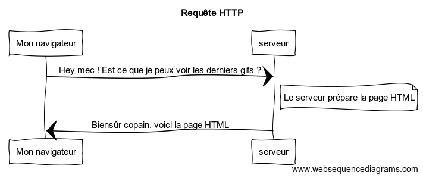

# Symfony et HTTP
Un peu de théorie avant de foncer tête baissée dans le code.

## Requêtes et Réponses HTTP
HTTP (Hypertext Transfer Protocol) est un protocole qui permet à deux
machines de communiquer entre elles. Par exemple, lors de la recherche
des derniers gifs des [joies du code](https://lesjoiesducode.fr/),
la conversation (approximative) suivante a lieu :



## Étapes 1 : Le Client Envoie une Requête
Toute les conversations sur le web commencent par l'envoi d'une requête.  
Le client envoie une requête HTTP à un serveur et attend une réponse.


En termes HTTP voici à quoi cela ressemble :
``` http
GET / HTTP/1.1
Host: lesjoiesducode.fr
Accept: text/html
User-Agent: Mozilla/5.0 (Macintosh)
```
```GET / HTTP/1.1``` : La première ligne est très importante puisqu'elle indique la __méthode__ (GET)
et l' __URI__ (/).  
L'URI (```/```, ```/contact```, ```/user/1```, etc) est l'adresse
unique indiquant où se trouve la ressource souhaitée.
La méthode (on parle aussi de verbe) HTTP indique ce que le client __veut faire__ avec cette ressource.   
```Accept: text/html``` : définit le format demandé en retour par le serveur ()

Les méthodes les plus courantes sont les suivantes :
- __GET__ :  
  __Récupérer__ la ressource du serveur (par exemple lors de la visite d'une page) ;
- __POST__ :  
  __Créer__ une ressource sur le serveur (par exemple lors de la soumission
  d'un formulaire) ;
- __PUT/PATCH__ :  
  __Mettre à jour__ la ressource sur le serveur (utilisée par les API) ;
- __DELETE__ :   
  __Supprimer__ la ressource du serveur (utilisée par les API) ;
- [Liste de toutes les méthodes](https://en.wikipedia.org/wiki/Hypertext_Transfer_Protocol#Request_methods).

Exemple :
``` http
DELETE /blog/15 HTTP/1.1
```
## Étapes 2 : Le serveur Retourne une Réponse


Traduit en HTTP, voici ce que cela donne :
``` http
HTTP/1.1 200 OK
Date: Sat, 02 Apr 2011 21:05:05 GMT
Server: lighttpd/1.4.19
Content-Type: text/html

<html>
  <!-- ... HTML for the gif -->
</html>
```

La réponse HTTP contient la ressource demandée (ici du HTML)
et d'autres informations.

La première ligne est très importante puisqu'elle contient le status de
la réponse HTTP (200 ici).  
Ce status indique le résultat global de la requête : est ce que c'est un succès ?
Est ce qu'il y'a des erreurs ? Est ce que la ressource est introuvable ?
Quelques exemple :
- 200 OK : succès ;
- 301 Moved Permanently : la ressource n'est plus accessible à cette adresse,
  mais à une autre adresse ;
- 404 Not Found : le ressource est introuvable;
- 500 Internal Server Error : une réponse générique lorsque survient une erreur
  serveur ;
- [Liste de tous les statuts](https://en.wikipedia.org/wiki/List_of_HTTP_status_codes).

La réponse contient aussi le __Content-Type__ afin de spécifier au navigateur
ce qui est retourné.
Ici du HTML mais ça aurait pu aussi être du JSON ou du XML par exemple
([liste des types](https://www.iana.org/assignments/media-types/media-types.xhtml)).

## Requête, Réponse, et Développement Web :
Cette conversation "demande-réponse" est le processus __fondamental__ qui anime toutes les communications sur le Web. Et aussi important et puissant qu'est ce processus, il est néanmoins très simple.

Le fait le plus important est le suivant :
>Quel que soit le langage utilisé, le type d'application que nous créons (web, mobile, API JSON) ou la philosophie de développement que nous suivons, l'objectif final d'une application est toujours de __comprendre__ chaque requête, de __créer__ et de __renvoyer__ la __réponse__ appropriée.

N'hésites pas à approfondir et à te documenter sur [HTTP](https://en.wikipedia.org/wiki/Hypertext_Transfer_Protocol) !

## Requête et Réponse en PHP
``` php
<?php
// pour la requête /testing?foo=symfony
$uri = $_SERVER['REQUEST_URI']; // l'URI demandée = /testing?foo=symfony
$foo = $_GET['foo']; // GET du paramètre foo = symfony

header('Content-Type: text/html'); // on spécifie le content-type
echo 'The URI requested is: '.$uri;
echo 'The value of the "foo" parameter is: '.$foo;
```
Ce code, aussi petit qu'il soit, prend les informations de la requête HTTP et l'utilise pour créer une résponse HTTP.
Voici ce qui sera renvoyé :
``` http
HTTP/1.1 200 OK
Date: Sat, 03 Apr 2011 02:14:33 GMT
Server: Apache/2.2.17 (Unix)
Content-Type: text/html

The URI requested is: /testing?foo=symfony
The value of the "foo" parameter is: symfony
```

## Requête et Réponse en Symfony
### L'objet Request
La classe Request est une représentation orientée objet du message de requête HTTP. Avec elle, nous avons toutes les informations de la requête à portée de main:
``` php
<?php
use Symfony\Component\HttpFoundation\Request;

$request = Request::createFromGlobals();

// l' URI requêtée (par exemple /about) et les paramètres
$request->getPathInfo();

// récupérer les variables $_GET
$request->query->get('id');

// récupérer les variables $_POST 
$request->request->get('category', 'default category');

// récupérer les variables $_SERVER
$request->server->get('HTTP_HOST');

// récupérer l'instance de UploadedFile identifiée par "attachment"
$request->files->get('attachment');

// récupérer une valeur de $_COOKIE
$request->cookies->get('PHPSESSID');

// récupérer les headers HTTP
$request->headers->get('host');
$request->headers->get('content_type');

$request->getMethod();    // par exemple GET, POST, PUT, DELETE ou HEAD
$request->getLanguages(); // un tableau des languages que le client accepte

$request->isSecure(); // est ce que c'est du HTTPS ?
```
En prime, la classe _Request_ fait beaucoup de travail en arrière-plan dont nous n'aurons jamais à nous inquiéter. Par exemple, la méthode _isSecure()_ vérifie que l'utilisateur se connecte via une connexion sécurisée (HTTPS).

### L'objet Response
Symfony fournit également une classe Response: une représentation PHP simple d'un message de réponse HTTP. Cela permet à notre application d'utiliser une interface orientée objet pour construire la réponse qui doit être renvoyée au client:
``` php
<?php
use Symfony\Component\HttpFoundation\Response;

$response = new Response();

$response->setContent('<html><body><h1>Hello world!</h1></body></html>');
$response->setStatusCode(Response::HTTP_OK);

// définit le header de la réponse HTTP
$response->headers->set('Content-Type', 'text/html');

// envoie les headers HTTP suivis du contenu
$response->send();
```
Il existe également plusieurs sous-classes de réponses pour nous aider à renvoyer du JSON, à rediriger du HTML, à télécharger des fichiers en continu, etc...

## Le voyage de la demande à la réponse
Comme HTTP lui-même, l'utilisation des objets Request et Response est assez simple. La partie difficile de la construction d'une application est d'écrire ce qui se passe entre les deux. En d'autres termes, le vrai travail vient en écrivant le code qui interprète l'information de demande et crée la réponse.

Notre application fait probablement beaucoup de choses, comme l'envoi de courriels, le traitement de soumissions de formulaires, l'enregistrement de données dans une base de données, le rendu de pages HTML et la protection de contenu avec sécurité. Comment pouvons-nous gérer tout cela et garder notre code organisé et maintenable ? Symfony a été créé pour nous aider avec ces problèmes.

### Le Front Controller
Traditionnellement, les applications étaient construites de sorte que chaque "page" d'un site soit son propre fichier physique (par exemple ```index.php```, ```contact.php```, etc...).

Il y a plusieurs problèmes avec cette approche, y compris la rigidité des URLs (et si nous voulions changer ```blog.php``` en ```news.php``` sans casser tous nos liens ?) Et le fait que chaque fichier doit inclure manuellement un ensemble de fichiers _Core_ afin que la sécurité, les connexions à la base de données et le "look" du site puissent rester cohérents.

Une meilleure solution consiste à utiliser un contrôleur frontal: un seul fichier PHP qui gère toutes les demandes entrant dans notre application. Par exemple:

| URL                | execute           | 
| ------------------ |:-----------------:| 
| /index.php         | execute index.php | 
| /index.php/contact | execute index.php | 
| /index.php/blog    | execute index.php | 

Maintenant, chaque demande est traitée exactement de la même manière. Au lieu d'URL individuelles exécutant différents fichiers PHP, le contrôleur frontal est toujours exécuté et le routage de différentes URL vers différentes parties de notre application est effectué en interne.

## Le flux d'applications Symfony


Les demandes entrantes sont interprétées par le composant Routage et transmises aux fonctions PHP qui retournent les objets Response.

Tout ça n'a peut-être pas encore de sens, mais au fur et à mesure du cours, nous découvrirons les routes et les contrôleurs: les deux parties fondamentales de la création d'une page. Mais au fur et à mesure, n'oublie pas que, __quelle que soit la complexité de ton application, ton travail est toujours le même : lis les informations de la demande et utilise-la pour créer une réponse__.

## Conclusion
Voici ce que nous avons appris jusqu'à présent:

1. Un client (par exemple un navigateur) envoie une requête HTTP ;
2. Chaque requête exécute le même fichier unique (appelé "contrôleur frontal", ici : ```public/index.php```) ;
3. Le contrôleur frontal démarre Symfony et transmet les informations de requête ;
4. En interne, Symfony utilise des routes et des contrôleurs pour créer la réponse pour la page ;
5. Symfony transforme notre objet Response en headers et en contenu (c'est-à-dire la réponse HTTP), qui sont renvoyés au client.

# Pourquoi voir tout cela ?
## Car La philosophie de Symfony est la suivante :
>Garde à l'esprit que le but de ton application est toujours d'interpréter une requête et de créer la réponse appropriée en fonction de la logique de ton application.
---------------
>source : [https://symfony.com/doc/current/create_framework/http_foundation.html](https://symfony.com/doc/current/create_framework/http_foundation.html)